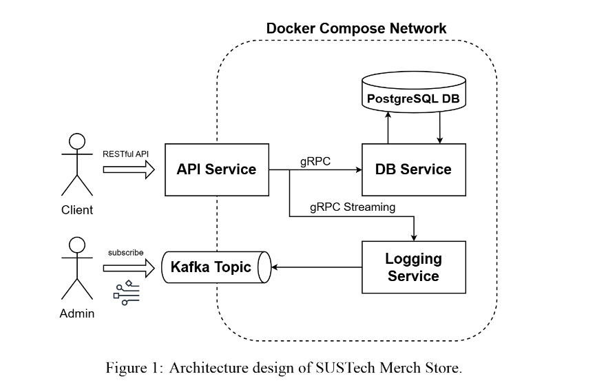

# Report: Implementation of SUSTech Merch Store

## 1. Introduction

This report documents the design and implementation of the **SUSTech Merch Store**. The store will allow external customers to view products, maintain user accounts, and place orders through a RESTful API service. The backend consists of various microservices communicating over gRPC, including a product database service, user management, and a logging service for monitoring. The store’s architecture is built using **Docker Compose** for easy deployment, with **PostgreSQL** as the database, and **Kafka** for logging and monitoring.

## 2. Architecture Design

### Overview
The architecture consists of the following components:

1. **RESTful API Service**: Exposes public APIs for customer interaction.
2. **gRPC DB Service**: Manages database operations and provides a connection pool for the RESTful API service.
3. **Logging Service**: Collects logs from the API and DB services and publishes them to a Kafka topic for monitoring.
4. **PostgreSQL Database**: Stores product, user, and order information.
5. **Kafka**: Used to monitor logs and manage messages from services.
6. **Docker Compose**: Ensures all components run in a containerized environment for consistency.

### Detailed Components and Their Interactions

- **Product Information**: The product details (e.g., name, price, stock) are stored in a PostgreSQL database. The products are pre-added and cannot be modified during the event.
  
- **User Management**: Users must register and log in to place orders. User data, including username and password hash, is stored in the `users` table. Users authenticate via JWT tokens to interact with the system securely.

- **Order Management**: Orders are stored in the `orders` table. Each order has an associated user, product, quantity, and total price. A user can place only up to 3 items per order.

- **DB Service**: Acts as a mediator between the RESTful API service and the PostgreSQL database. It manages database connections and implements CRUD operations for products, users, and orders.

- **Logging Service**: Uses gRPC streaming to receive log messages from both the API and DB services, which are then published to Kafka for monitoring.

- **Kafka**: Logs generated by services are sent to a Kafka topic. Administrators can subscribe to this topic to monitor system activities.

## 3. Implementation

### 3.1 API Service

The **RESTful API Service** implements the following functionalities:

#### (a) Greeting API
A simple greeting API at the base URL:

- **GET** `/`: Returns a welcome message (e.g., "Welcome to the SUSTech Merch Store").

#### (b) Product Operations
The API exposes the following product-related endpoints:
  
- **GET** `/products`: Lists all available products.
- **GET** `/products/{product_id}`: Retrieves details of a specific product by its ID.

#### (c) User Operations
User management includes:

- **POST** `/users/register`: Registers a new user.
- **POST** `/users/login`: Authenticates a user and generates a JWT token.
- **PUT** `/users/{user_id}/deactivate`: Deactivates a user account.
- **GET** `/users/{user_id}`: Retrieves user details.
- **PUT** `/users/{user_id}`: Updates user information.

#### (d) Order Operations
Order management includes the following endpoints:

- **POST** `/orders`: Places an order for products.
- **PUT** `/orders/{order_id}/cancel`: Cancels an order.
- **GET** `/orders/{order_id}`: Retrieves details of an order.

